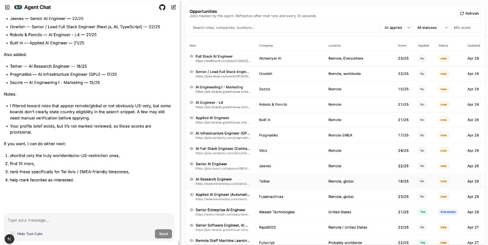

# JobSearchAgent

Personal AI job search and opportunity tracker built around LangChain, LangGraph, LangSmith, FastAPI, Postgres, and a custom Agent Chat UI workspace.

The app lets you chat with an agent while keeping a structured opportunities table as the source of truth for roles, links, fit scores, application status, interview state, and notes.



## Features

- Chat-based job intake from pasted links, job descriptions, CSVs, and tables.
- Opportunity table with search, score/status/applied filters, sorting, modal details, and quick status updates.
- 25-point fit scoring rubric with sub-scores stored in metadata.
- Resume/profile context tools so the agent can score roles against your background.
- URL extraction and optional Tavily web search for job/company research.
- Local Docker Compose stack for Postgres, migrations, FastAPI, LangGraph, and the UI.

## Stack

- Backend: FastAPI, SQLModel, Alembic, PostgreSQL
- Agent: LangChain, Deep Agents, LangGraph, LangSmith, OpenAI, Tavily
- UI: Agent Chat UI, Next.js, Tailwind CSS, TanStack Query, TanStack Table

## Local Setup

Start the full local app:

```bash
cp backend/.env.example backend/.env
docker compose up
```

Open `http://localhost:13000`.

If that port is already in use, run for example:

```bash
UI_PORT=13001 docker compose up
```

Or start services manually:

```bash
docker compose up -d postgres
cd backend
uv sync --extra dev
cp .env.example .env
uv run alembic upgrade head
uv run api
```

Start the agent server:

```bash
uv run langgraph dev --port 12024
```

Start the UI:

```bash
cd ui
nvm use
corepack enable
cp .env.example .env.local
pnpm dev --filter=web
```

More details: [Development guide](docs/development.md).

## Project Docs

- [Architecture plan](docs/architecture-plan.md)
- [Development guide](docs/development.md)
- [Folder structure plan](docs/folder-structure-plan.md)
- [User stories](docs/user-stories.md)
- [Project checklist](docs/todo.md)

